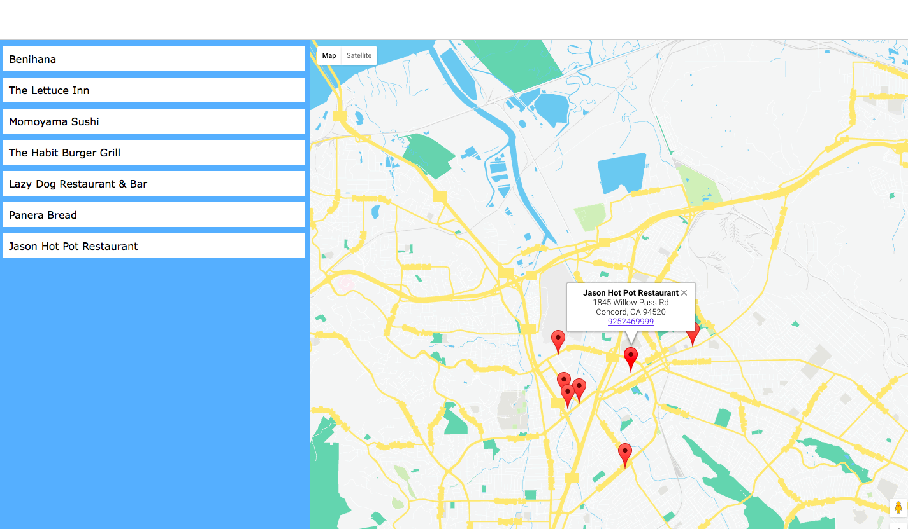

# Bay Area Yellow Page
This is a **single page application** that shows my favorite restaurant around **Bay Area**.

# Technology used for this app:
+ **1. Use [Google Map API](https://developers.google.com/maps/to) to display map in browser**
+ **2. Adding [map marker](https://developers.google.com/maps/documentation/javascript/markers) and [info window](https://developers.google.com/maps/documentation/javascript/infowindows)**
+ **3. Using AJAX to call third party API from [Foursquare](https://developer.foursquare.com)**
+ **4. Push data to Google markers with [Knockoutjs](http://knockoutjs.com)**

# Functionality:
This App is design to display some of my favorite restaurant in Bay Area. I used Google map API to display map on browser, with markers, and info window. Then with AJAX I called JSON data form third party API in this case Foursquare. Then parsing data, and using Knockoutjs for data binding, and push it to info window.

All the info of the places is coming from third party website (Foursquare.)
This app is designed responsive for any size of device. You can try it by changing the size of your device.

Click here to try it out:
<https://m-matin.github.io/Bay-Area-Yellow-Page/>

## For Download:
`git clone https://github.com/M-Matin/Bay-Area-Yellow-Page.git`

Or click here: <https://github.com/M-Matin/Bay-Area-Yellow-Page/archive/gh-pages.zip>

## Install with Bower.

`$ bower install`

